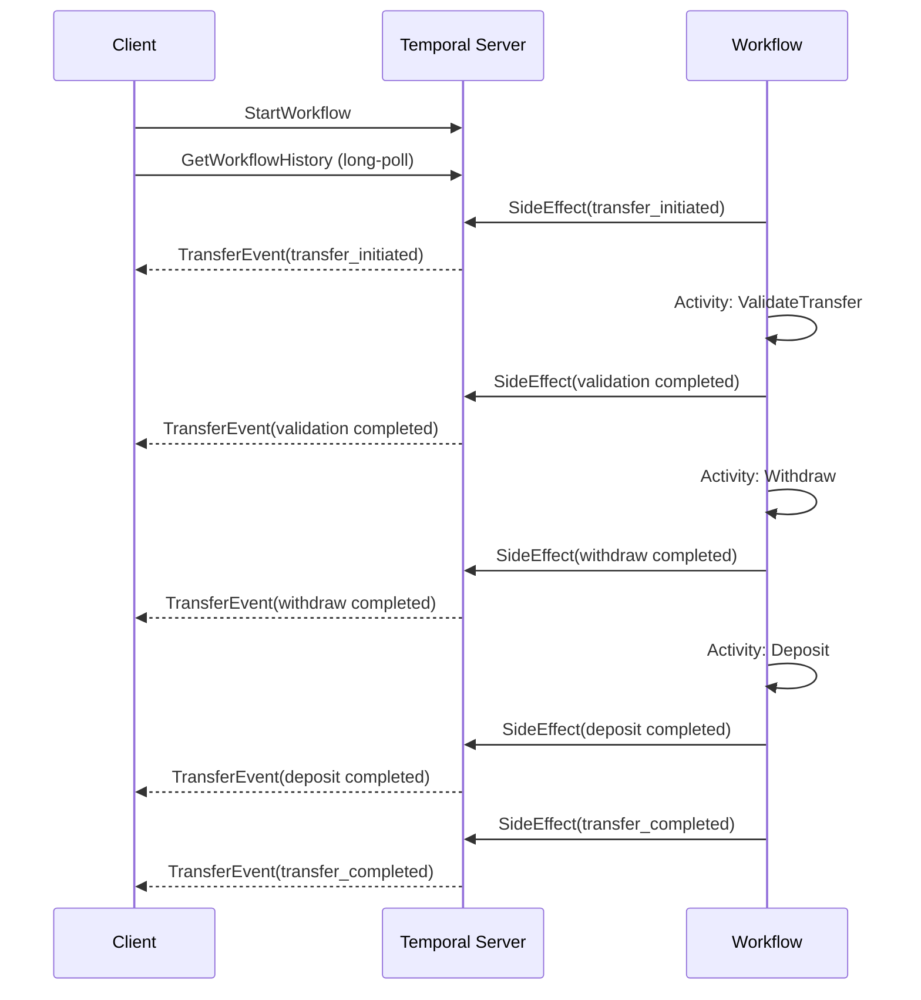

# Event Stream

Demonstrates using `workflow.SideEffect` to emit custom events during workflow execution, and using `GetWorkflowHistory` (long-poll) on the client side to stream and decode those events in real time.

Uses a money transfer workflow as an example — after each activity (validate, withdraw, deposit), a `TransferEvent` is recorded via `SideEffect`. The starter polls the workflow history for `MarkerRecorded` events with marker name `"SideEffect"`, decodes the payload, and prints it.

## Sequence Diagram



## Running

Start the worker:
```bash
go run event_stream/worker/main.go
```

In another terminal, start the workflow and stream events:
```bash
go run event_stream/starter/main.go
```
