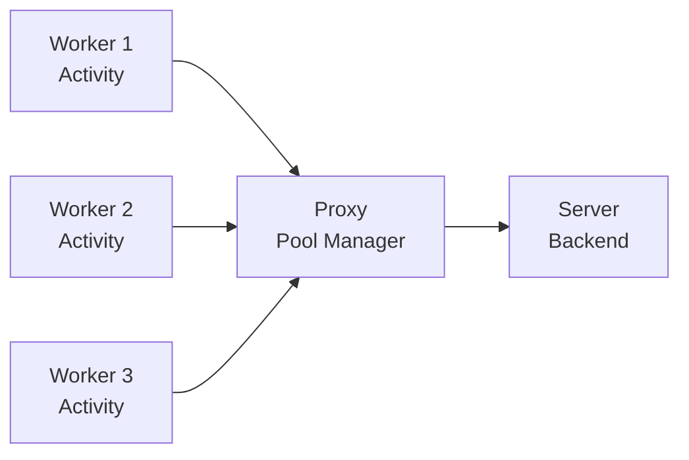

# Proxied Activities

Demonstrates activity execution through TCP proxy connections in Temporal workflows.

## Overview

This sample shows how to execute Temporal activities that communicate through a TCP proxy, maintaining connection pooling and handling multiple concurrent activity executions.

## Architecture



## Components

- **server/main.go**: Backend TCP server that processes activity requests
- **proxy/main.go**: TCP proxy that manages connections between activities and server
- **client.go**: Temporal activity implementation using proxied connections
- **workflow.go**: Workflow that executes proxied activities

## Running

```bash
./run.sh
```

The workflow executes activities that communicate through the proxy, demonstrating how to handle network intermediaries in Temporal applications.